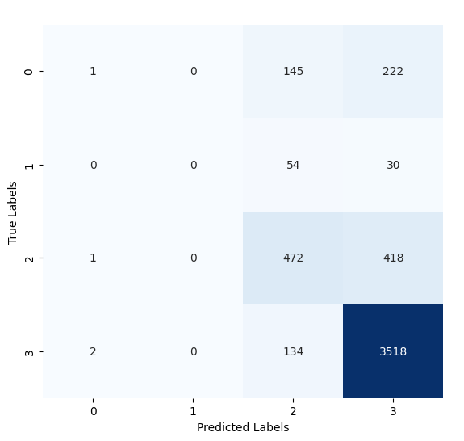
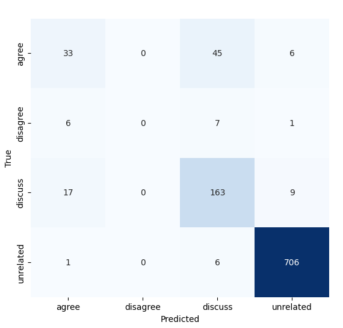

# Fake News Detection Using Stance Detection

## About

- <strong>University: </strong>University of Prishtina
- <strong>Faculty: </strong>Faculty of Electrical and Computer Engineering
- <strong>Study Program: </strong>Master of Computer and Software Engineering
- <strong>Subject (2nd year): </strong>Natural Language Processing taught by [Dr. Sc. Mërgim Hoti](https://staff.uni-pr.edu/profile/m%C3%ABrgimhoti)
- <strong>Students:</strong> [Festina Qorrolli](https://github.com/festinaqorrolli) and [Fisnik Spahija](https://github.com/Fisinik/)

The goal of this [project](https://github.com/fisinik/fake-news-detection-using-stance-detection) is to develop a system that uses stance detection to identify fake news. The model analyzes the relationship between claims made in an article and other sources of verified information to assess the truthfulness of the content.. This project is used for the Natural Language Processing course in University of Prishtina, Computer and Software Engineering.

## Instructions

This project requires venv environment. This can be done by creating a workspace environment through VScode. Make sure python and pip are installed.

Install kernel for the environment by running the following command in the terminal:

```bash
pip install ipykernel
```

Install the necessary packages.

```bash
pip install -r requirements.txt
```

## Datasets overview

### Attributes of FNC-1 (4):

- "Headline" <strong>(categorical nominal)</strong>
- "ArticleBody" <strong>(categorical nominal)</strong>
- "Body ID" <strong>(categorical nominal)</strong>
- "Stance" <strong>(categorical nominal)</strong>

### Attributes of FARN (5):

- "Title" <strong>(categorical nominal)</strong>
- "Text" <strong>(categorical nominal)</strong>
- "Subject" <strong>(categorical nominal)</strong>
- "Date" <strong>(categorical nominal)</strong>
- "Stance" <strong>(categorical nominal)</strong>

### Data integration

Our datasets are separated as following:

#### FNC-1

train_bodies.csv and train_stances.csv files. These are combined by the "Body ID" to a single dataframe containing all the attributes needed to move forward.

#### FARN

fake_news.csv and real_news.csv files are separated on the stance basis. We combine both datasets into a dataframe and add a stance for both files "FAKE" and "REAL".

### Dataset Size

#### FNC-1

The distribution of `Stance` classes in `train_stances.csv` is as follows:

|  rows | unrelated | discuss |     agree |  disagree |
| ----: | --------: | ------: | --------: | --------: |
| 49972 |   0.73131 | 0.17828 | 0.0736012 | 0.0168094 |

#### FARN

The distribution of `Stance` classes in `fake_news.csv` and `real_news.csv` is as follows:

|  rows |   fake |   real |
| ----: | -----: | -----: |
| 44919 | 0.5232 | 0.4768 |

## Training the models

During training, the model learns patterns on the data.
It is therefore essential to analyze and compare the performance of the model against other algorithms to determine if further additional optimizations are needed.

We will analyze 3 different algorithms which are:

- Logistic Regression
- XGBoost
- DistilBERT

We will evaluate using metrics like Accuracy, F1-score, Recall, and Precision.

- Accuracy: It measures the overall correctness of a model by comparing the number of correct predictions to the total number of predictions made. Mathematically, accuracy is calculated as (TP + TN) / (TP + TN + FP + FN), where TP is True Positives, TN is True Negatives, FP is False Positives, and FN is False Negatives.

- Recall (Sensitivity or True Positive Rate): It measures the ability of a model to correctly identify positive instances from all actual positive instances. It is calculated as TP / (TP + FN), where TP is True Positives and FN is False Negatives. High recall indicates that the model is good at minimizing false negatives.

- Precision: It measures the accuracy of positive predictions made by the model. It is calculated as TP / (TP + FP), where TP is True Positives and FP is False Positives. Precision is important when the cost of false positives is high.

- F1 Score: It is the harmonic mean of precision and recall, providing a balance between the two metrics. It is calculated as 2 _ (Precision _ Recall) / (Precision + Recall). F1 score is useful when there is an uneven class distribution, as it considers both false positives and false negatives.

### Confusion Matrix for Logistic Regression

Below is the confusion matrix for the Logistic Regression model:



### Confusion Matrix for XGBoost


### Confusion Matrix for DistilBERT



### Model Performance Comparison

| Metric              | Logistic Regression | XGBoost |
| ------------------- | ------------------- | ------- |
| Training Accuracy   | 80.13%              | 86.34%  |
| Test Accuracy       | 79.87%              | 83.95%  |
| Validation Accuracy | 80.59%              | 83.61%  |
