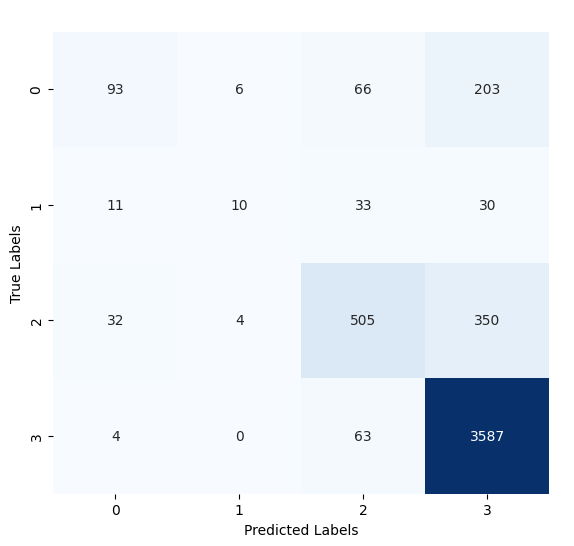

# Fake News Detection Using Stance Detection

## About

- <strong>University: </strong>University of Prishtina
- <strong>Faculty: </strong>Faculty of Electrical and Computer Engineering
- <strong>Study Program: </strong>Master of Computer and Software Engineering
- <strong>Subject (2nd year): </strong>Natural Language Processing taught by [Dr. Sc. Mërgim Hoti](https://staff.uni-pr.edu/profile/m%C3%ABrgimhoti)
- <strong>Students:</strong> [Festina Qorrolli](https://github.com/festinaqorrolli) and [Fisnik Spahija](https://github.com/Fisinik/)

The goal of this [project](https://github.com/fisinik/fake-news-detection-using-stance-detection) is to develop a system that uses stance detection to identify fake news. The model analyzes the relationship between claims made in an article and other sources of verified information to assess the truthfulness of the content.. This project is used for the Natural Language Processing course in University of Prishtina, Computer and Software Engineering.

## Instructions

This project requires venv environment. This can be done by creating a workspace environment through VScode. Make sure python and pip are installed.

Install kernel for the environment by running the following command in the terminal:

```bash
pip install ipykernel
```

Install the necessary packages.

```bash
pip install -r requirements.txt
```

The datasets can be found here: [FNC-1](https://github.com/FakeNewsChallenge/fnc-1) and [FARN](https://www.kaggle.com/datasets/clmentbisaillon/fake-and-real-news-dataset/data)

## Datasets overview

### Attributes of FNC-1 (4):

- "Headline" <strong>(categorical nominal)</strong>
- "ArticleBody" <strong>(categorical nominal)</strong>
- "Body ID" <strong>(categorical nominal)</strong>
- "Stance" <strong>(categorical nominal)</strong>

### Attributes of FARN (5):

- "Title" <strong>(categorical nominal)</strong>
- "Text" <strong>(categorical nominal)</strong>
- "Subject" <strong>(categorical nominal)</strong>
- "Date" <strong>(categorical nominal)</strong>
- "Stance" <strong>(categorical nominal)</strong>

### Data integration

Our datasets are separated as following:

#### FNC-1

train_bodies.csv and train_stances.csv files. These are combined by the "Body ID" to a single dataframe containing all the attributes needed to move forward.

#### FARN

fake_news.csv and real_news.csv files are separated on the stance basis. We combine both datasets into a dataframe and add a stance for both files "FAKE" and "REAL".

### Dataset Size

#### FNC-1

The distribution of `Stance` classes in `train_stances.csv` is as follows:

|  rows | unrelated | discuss |     agree |  disagree |
| ----: | --------: | ------: | --------: | --------: |
| 49972 |   0.73131 | 0.17828 | 0.0736012 | 0.0168094 |

#### FARN

The distribution of `Stance` classes in `fake_news.csv` and `real_news.csv` is as follows:

|  rows |   fake |   real |
| ----: | -----: | -----: |
| 44919 | 0.5232 | 0.4768 |

## Training the models

During training, the model learns patterns on the data.
It is therefore essential to analyze and compare the performance of the model against other algorithms to determine if further additional optimizations are needed.

We will analyze 3 different algorithms which are:

- Logistic Regression
- XGBoost
- DistilBERT

We will evaluate using metrics like Accuracy, F1-score, Recall, and Precision.

- Accuracy: It measures the overall correctness of a model by comparing the number of correct predictions to the total number of predictions made. Mathematically, accuracy is calculated as (TP + TN) / (TP + TN + FP + FN), where TP is True Positives, TN is True Negatives, FP is False Positives, and FN is False Negatives.

- Recall (Sensitivity or True Positive Rate): It measures the ability of a model to correctly identify positive instances from all actual positive instances. It is calculated as TP / (TP + FN), where TP is True Positives and FN is False Negatives. High recall indicates that the model is good at minimizing false negatives.

- Precision: It measures the accuracy of positive predictions made by the model. It is calculated as TP / (TP + FP), where TP is True Positives and FP is False Positives. Precision is important when the cost of false positives is high.

- F1 Score: It is the harmonic mean of precision and recall, providing a balance between the two metrics. It is calculated as 2 _ (Precision _ Recall) / (Precision + Recall). F1 score is useful when there is an uneven class distribution, as it considers both false positives and false negatives.

### Confusion Matrix for Logistic Regression

Below is the confusion matrix for the Logistic Regression model:

Logistic regression has given a good performance on Unrelated classification (label 3) with 3518 true positives. However, some instances were misclassified as "Discuss" (Label 2), leading to confusion. There was a noticed difficulty in distinguishing between "Agree" (Label 0) and "Discuss" (Label 2), as seen from the 472 samples from the "Discuss" class being misclassified as "Agree.". Predictions for the "Disagree" (Label 1) class were particularly challenging, with a high number of instances incorrectly labeled as "Discuss."

This suggests that the model is effective for separating "Unrelated" articles, but struggles with more subtle distinctions such as between "Agree" and "Discuss.".


### Confusion Matrix for XGBoost

The confusion matrix for XGBoost demonstrates improved performance across all classes. The "Unrelated" class (Label 3) achieved a high true positive count of 3,587, with fewer misclassifications compared to Logistic Regression. XGBoost showed a marked improvement in handling the "Discuss" class, correctly predicting 505 instances, although some were still misclassified as "Unrelated" (Label 3) or "Agree" (Label 0). Predictions for "Agree" (Label 0) and "Disagree" (Label 1) also showed enhanced precision, with fewer instances mislabeled in comparison.

Overall, XGBoost outperformed Logistic Regression, particularly in handling nuanced distinctions between the stance classes, due to its ability to model complex, non-linear relationships in the data.



### Confusion Matrix for DistilBERT

DistilBERT demonstrates superior performance across most classification metrics when compared to Logistic Regression and XGBoost. Even using 10 percent of the dataset, its training accuracy of 93.55% and test accuracy of 90.2% indicate robust generalization to unseen data. The model excels particularly in correctly classifying "Unrelated" (Label 3) samples, achieving a substantial number of true positives. This reflects its ability to identify articles with no direct relationship to claims more effectively than the other models.


However, similar to Logistic Regression and XGBoost, some challenges persist in distinguishing between classes with nuanced relationships. For example, while DistilBERT performs better in separating "Agree" (Label 0) and "Discuss" (Label 2) classes, a certain degree of misclassification still exists, albeit at lower levels compared to Logistic Regression and XGBoost. The confusion matrix shows a notable improvement in minimizing errors across these categories, highlighting DistilBERT's ability to capture subtle contextual relationships that simpler models struggle with.

### Model Performance Comparison

The results in the table above show that DistilBERT outperforms both Logistic Regression and XGBoost in terms of accuracy across training, test, and validation datasets. DistilBERT achieves the highest training accuracy at 93.55%, test accuracy at 90.2%, and validation accuracy at 90.2%. XGBoost follows with a training accuracy of 86.34%, test accuracy of 83.95%, and validation accuracy of 83.61%. Logistic Regression has the lowest performance among the three, with a training accuracy of 80.13%, test accuracy of 79.87%, and validation accuracy of 80.59%.

| Metric              | Logistic Regression | XGBoost | DistilBERT |
| ------------------- | ------------------- | ------- | ---------- |
| Training Accuracy   | 80.13%              | 86.34%  | 93.55%     |
| Test Accuracy       | 79.87%              | 83.95%  | 90.2%      |
| Validation Accuracy | 80.59%              | 83.61%  | 90.2%      |

These results indicate that DistilBERT, a transformer-based model, is more effective in capturing the nuances of the data compared to the other two algorithms. However, it is also important to consider the computational resources and time required for training these models, as more complex models like DistilBERT typically require more resources. The choice of model should balance accuracy with resource constraints and the specific needs of the application.

## Conclusion

In conclusion, the project demonstrates the effectiveness of using stance detection for fake news identification. By leveraging different machine learning algorithms such as Logistic Regression, XGBoost, and DistilBERT, we were able to achieve significant accuracy in detecting fake news. Each model has its strengths and weaknesses, and the choice of model can depend on the specific requirements and constraints of the application. Future work could involve further optimization of these models, exploring additional features, and integrating more diverse datasets to enhance the robustness and generalizability of the fake news detection system.
